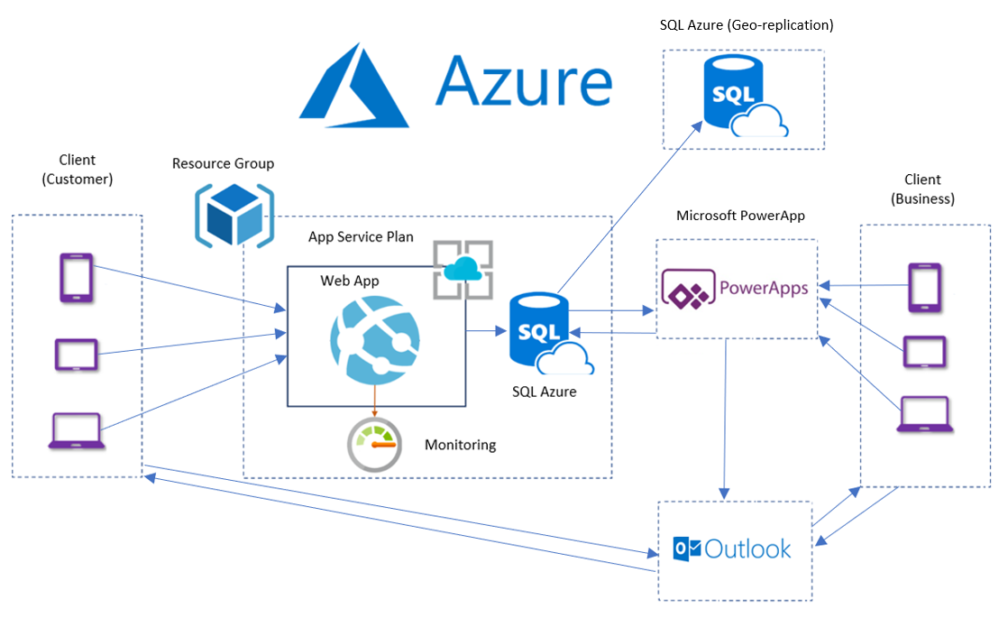

<h1 align="center">Information Systems Development</h1>

# Project Overview

The Dough Bros Pizza Order, Delivery and Management System is a project developed using the Agile and Waterfall methodologies to improve business processes and drive a digital transformation. The project itself consisted of a C# ASP.NET website in the form of an Microsoft Azure Web-App connected to an Virtual Machine with a MS SQL Server with Microsoft PowerApps integration for the management of data and functions.

- Project Date: March/April 2020

<h1 align="center">

</h1>

# Table of Contents

- [Project Overview](#project-overview)
- [Table of Contents](#table-of-contents)
- [Project Description](#project-description)
- [Business Process Model](#business-process-model)
- [Technologies](#technologies)
- [Project Credits](#project-credits)
- [Schema](#schema)
- [System Document](#system-document)
- [Microsoft Azure Solution](#microsoft-azure-solution)
  - [Azure Portal](#azure-portal)

# Project Description

The project mostly consisted of a realistic software development project which included business analysis phases such as; Feasibility studies, Requirements catalog's, Functional/Non-functional requirements, Organisational Chart's, Context Diagrams, Use Case Diagram, Entity Relationship Diagram (ERD), Data Flow Diagram's (DFD 0, 1 & 2), Business Process Model (BMP), Rich Picture, Sequence Diagrams, System Diagrams, Data Dictionary.

The Implementation plan and schedule in terms of Jira/Gantt Chart to include GDPR, training and change management and data governance. The build aspect required a working prototype of a system.

The final project I developed is a ASP.NET web app website which provides an online presence for the company and allows new customers to order a pizza online by filling out a JavaScript form and submitting the form to our SQL Server hosted in Microsoft Azure. The order is submitted to the SQL server and the data (order and business information) is accessible and received by staff through a Microsoft PowerApp I developed for the staff to manage the orders. Further functionality exists on the PowerApp to manage other functions for the business such as managing reservations, the menu, costing and more, allowing centralised storage and accessability on the Azure Cloud.

[http://doughbros.azurewebsites.net/](http://doughbros.azurewebsites.net)

- Project Date: March & April 2020

- Included in this repo is:
  - [x] An offline version of the C# ASP.NET website in a Visual Studio `.sln` solution file
  - [x] Project Manual
  - [x] Microsoft PowerApp
  - [x] Business Analysis Documents, System Documents and more.
  - [x] Gantt Chart
  - [x] Data Dictionary

# Business Process Model

# Technologies

- Microsoft Azure
  - [x] Microsoft Azure App Service
  - [x] Microsoft Azure Virtual Machine
  - [x] Microsoft Azure SQL Server
    - [x] Stored Procedures
- [x] Microsoft PowerApps
- [x] Microsoft SQL Server Migration Assistant (SSMA)
- [x] Microsoft Visual Studio
- [x] C# ASP.NET Website

# Project Credits

- While the project was built as part of a team of three with Kevin, Nigel and myself, I was delegated as the Team Lead and was responsible for developing the practical implementation, business analysis phases including requirements gathering and developing a variety of technical diagrams.

# Schema

# System Document

The report includes elements such as:

- [x] Project Objectives
- [x] Feasability Studies
- [x] Requirements Gathering
- [x] Functional Requirements
- [x] Non-functional Requirements
- [x] Context Diagramss
- [x] Use Case Diagrams
- [x] Entity Relationship Diagrams
- [x] Data Flow Diagrams
- [x] Business Process Model
- [x] Rich Picture
- [x] Screengrabs of the final techical implementation

<h1 align="center">

</h1>

# Microsoft Azure Solution

## Azure Portal

<h2 align="center">
Dashboard

</h2>

<h1 align="center">

</h1>
